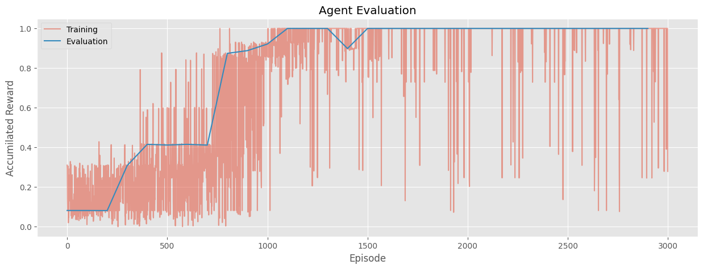
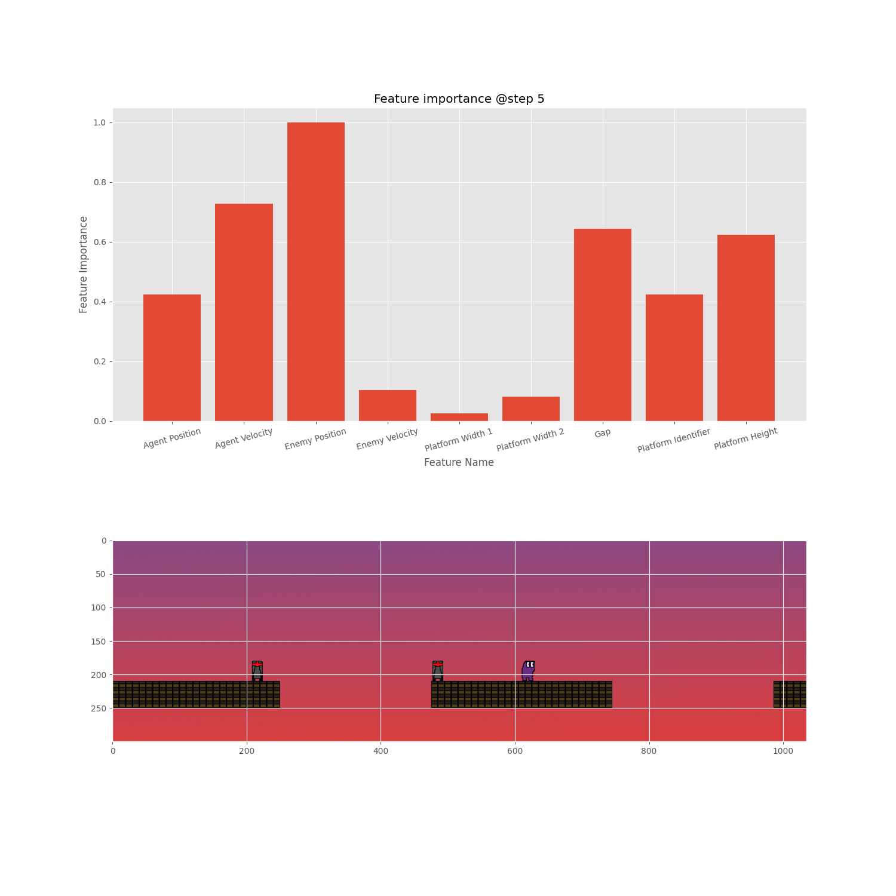

# RL-Approach
For solving the platform environment, the proposed architecture in [Multi-Pass Q-Networks for Deep Reinforcement Learning with
Parameterised Action Spaces](https://arxiv.org/pdf/1905.04388.pdf) was implemented. The development workflow was to start with a simplified implementation of the paper, and sequentially add proposed components/tricks to arrive at a minimal convergent implementation. <br />  <br /> For explainability, a GradCAM-like approach was adopted, which essentially backpropagates the Q-value corresponding to the optimal action to the states and then renormalizes the gradients as a proxy to the absolute feature importance that lead to the optimal action. Each feature has a feature importance in the range (0, 1).

# Installation
### creating a virtual environment
To create a virtual environment and upgrade pip, run 
```
make
```
from the project's root directory.
### installing dependancies
To install the necessary dependancies to running the scripts, run 
```
pip install -e .["all"] && pip install -e git+https://github.com/cycraig/gym-platform#egg=gym_platform
```
which installs the dependencies from requirements.in, requirements.dev.in along with the [hydra](https://hydra.cc/) search plugin.

# Running Training Code
From the project's root directory, run 
```
python scripts/train_mpq_agent.py
```
which will run the training entrypoint. The training entrypoint instantiates an agent as specified under configs/agents/mpq_agent.yaml. The configs related to the training options can be found under configs/training_entrypoint.yaml. <br /> <br /> Overrides are supported through the cli, for example to change the learning rate of the Q-network, one can run 
```
python scripts/train_mpq_agent.py agent.learning_rate_q=0.01
```
The training entrypoint initializes an [mlflow](https://mlflow.org/) run, and logs training and evaluation metrics as well as the best models and configs into the mlflow server (local). To visualize the experiments on the mlflow server, run 
```
mlflow ui
```
and paste the localhost url into your browser to start the ui. <br /> <br />
The agent evaluation plot for the best agent looks as follows:
<p align="center">
  
 </p>

# Running Inference Code
From the project's root directory, run 
```
python scripts/inference_mpq_agent.py training_run_id=PUT_YOUR_RUN_ID_HERE
```
which will run the inference entrypoint on the best model logged on the specified mlflow run. The training_run_id can be retrieved from the ui, and is also printed to the console upon the termination of the training entrypoint. <br /> <br /> The inference entrypoint unrolls the agent into the environment, and run the explainability module at each step to display which feature was the most important to take the chosen action along with a snapshot of the environment prior to taking the action. The explainibility plots are logged to a new mlflow run. An example of such a plot: <br /> <br /> 
<p align="center">
  
 </p>

# Running the End-to-End Pipeline
From the project's root directory, run 
```
python scripts/mpg_agent_pipeline.py
```
which will run the training entrypoint and pipe the training_run_id to the inference entrypoint directly.
